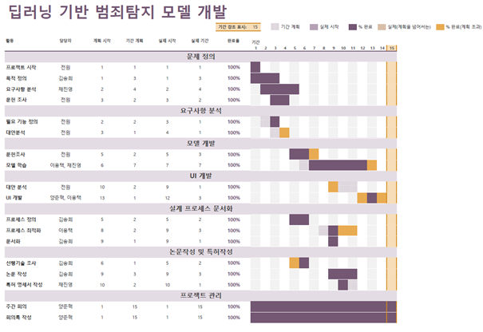

# 2019-2-CCD-OMG-6
## Criminal detection model using deep-learning

### Team members
 - Songhee Kim
 
 - JunHyuk Yang
 
 - YongTaek Lee
 
 - JinYeong Chae
 
### System Architecture

<p align="center">
  
</p>

### Image training system
<p align="center">
  
</p>

### Model Arichitecture(ResNet18)
<p align="center">
  
</p>

### Version
```
Python : 3.6
Pytorch : 1.3.1
Matplotlib : 3.1.1
Torchvision : 0.4.2
Django : 2.2.7
OpenCV
Skimage
PIL
Harrcascades
```
### Result
#### Image generated from StarGANS
<p align="center">
  
</p>

### Project Gantt Charts
<p>
  
</p>

